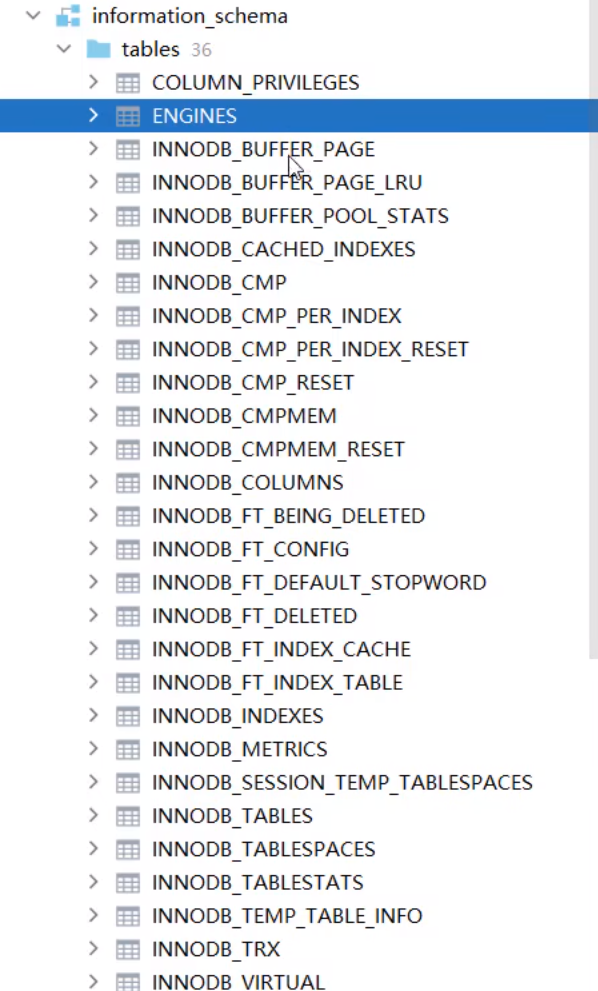

### 系统数据库

#### mysql

存储MySQL服务器正常运行所需要的各种信息（时区、主从、用户、权限等）。  


user表：用户信息。

#### information_schema  

提供了访问数据库元数据的各种表和视图，包含数据库、表、字段类型及访问权限等。



ENGINES：数据库支持的存储引擎。

下面是INNODB引擎的各项指标。  

view下的TABLES：当前数据库中的表。  


#### performance_schema

为MySQL服务器运行时状态提供了一个底层监控功能，主要用于收集数据库服务器性能参数。

锁的信息，事务的信息，报错日志的信息。

### sys

包含了一系列方便DBA和开发人员利用performance schema性能数据库进行性能调优和诊断的视图。


### 常用工具

#### mysqlbinlog

由于服务器生成的二进制日志文件以二进制格式保存，所以如果想要检查这些文本的文本格式，就会使用到mysqlbinlog日志管理工具。

```shell
mysqlbinlog [options]log-files1 log-files2...
```

#### mysqldump

mysqldump客户端工具用来备份数据库或在不同数据库之间进行数据迁移。备份内容包含创建表，及插入表的SQL语句。