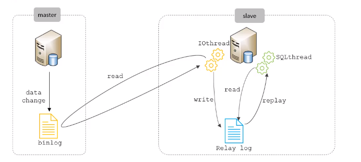
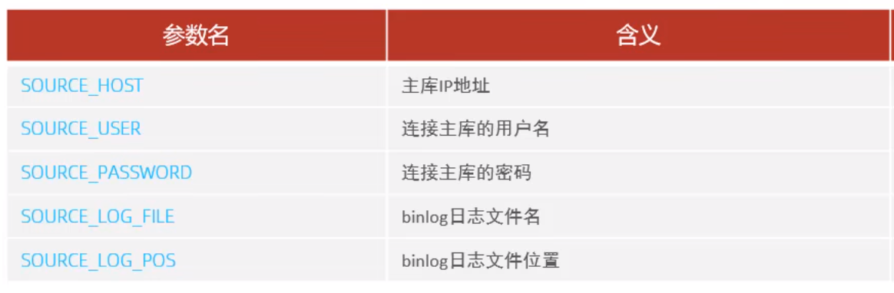

#### 概述

主从复制是指将主数据库的DDL和DML操作通过二进制日志传到从库服务器中，然后在从库上对这些日志重新执行（也叫重做），从而使得从库和主库的数据保持同步。  

MySQL支持一台主库同时向多台从库进行复制，从库同时也可以作为其他从服务器的主库，实现链状复制。

MySQL复制的有点主要包含以下三个方面：  

1.主库出现问题，可以快速切换到从库提供服务。  
2.实现读写分离，降低主库的访问压力。  
3.可以在从库中执行备份，以避免备份期间影响主库服务。

#### 原理



从上图来看，复制分成三步：  

1.Master主库在事务提交时，会把数据变更记录在二进制日志文件Binlog中。  
2.从库读取主库的二进制日志文件Binlog,写入到从库的中继日志Relay Log。   
3.slave重做中继日志中的事件，将改变反映它自己的数据。

#### 搭建

```shell
#开放指定的3306端口号：
firewall-cmd --zone=public --add-port=3306/tcp -permanent
firewall-cmd -reload
#关闭服务器的防火墙：
systemctl stop firewalld
systemctl disable firewalld
```

主库配置：

1.修改配置文件/etc/my.cnf

```shell
#ysql服务1D,保证整个集群环境中唯一，取值范围：1-2^32-1，默认为1
server-id=1
#是否只读，1代表只读，0代表读写
read-only=0
#忽略的数据，指不需要同步的数据库
#binlog-ignore-dk=mysql
指定同步的数据库
#binlog-do-db=db01
```

2.重启MySQL

3.登录mysql,创建远程连接的账号，并授予主从复制权限。

```shell
#创建itcast用户，并设置密码，该用户可在任意主机连接该ySQL服务
CREATE USER 'itcast'@%'IDENTIFIED WITH mysql_native_password BY 'Root@123456';
#为'itcast'@'%'用户分配主从复制权限
GRANT REPLICATION SLAVE ON *.* TO 'itcast'@'%';
```

4.通过指令，查询二进制日志坐标。

```
show master status;
```


从库配置：

1.修改配置文件/etc/my.cnf

```shell
#mysql服务ID,保证整个集群环境中唯一，取值范围：1-2^32-1飞和主库不一样即可
server-id=2
#是否只读，1代表只读，0代表读写
read-only=1
```

2.重启mysql

3.登录MySQL，设置主库配置。

```shell
CHANGE REPLICATION SOURCE TO SOURCE_HOST='xxx.xxx',SOURCE_USER='xxx',SOURCE_PASSWORD='xxx',SOURCE_LOG_FILE='xxx',SOURCE_LOG_POS=xxx;
```



4.开启同步操作

```shell
start replica; #8.0.22之后
start slave;    #8.0.22之前
```

5.查看主从同步状态

```shell
show replica status;#8.0.22之后
show slave status;#8.0.22之前
```


这两个参数为yes说明主从复制状态是正常的。


当前是从二进制日志position位置往后进行同步的。如果想要初始数据一致，可以导出主库数据为sql文件，从库执行该sql。