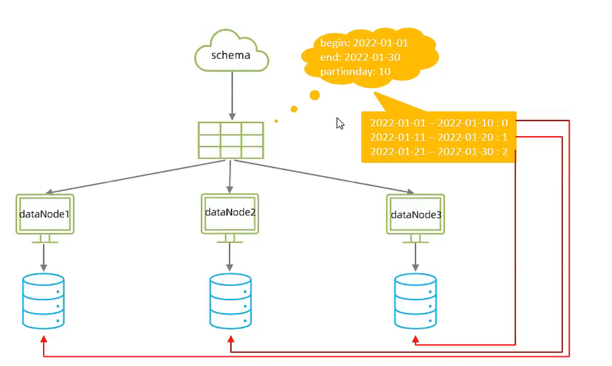
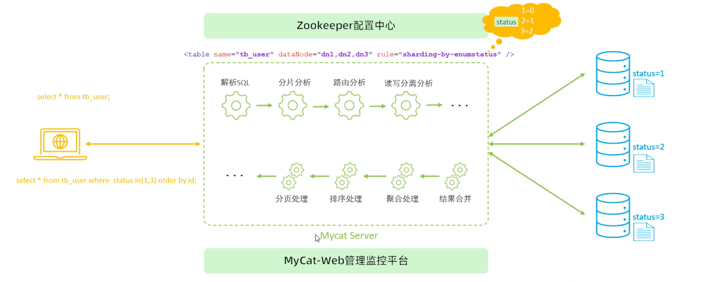

#### 问题分析：

随着互联网及移动互联网的发展，应用系统的数据量也是成指数式增长，若采用单数据库进行数据存储，存在以下性能瓶颈：  
1.IO瓶颈：热点数据太多，数据库缓存不足，产生大量磁盘IO,效率较低。请求数据太多，带宽不够，网络IO瓶颈。  
2.CPU瓶颈：排序、分组、连接查询、聚合统计等SQL会耗费大量的CPU资源，请求数太多，CPU出现瓶颈。

#### 垂直拆分


**垂直分库**：以表为依据，根据业务将不同表拆分到不同库中。  
特点：   
1.每个库的表结构都不一样。  
2.每个库的数据也不一样。  
3.所有库的并集是全量数据。

**垂直分表**：以字段为依据，根据字段属性将不同字段拆分到不同表中。  


特点：  
1.每个表的结构都不一样。  
2.每个表的数据也不一样，一般通过一列（主键/外键)关联。  
3.所有表的并集是全量数据。

#### 水平拆分


**水平分库**：以字段为依据，按照一定策略，将一个库的数据拆分到多个库中。   
特点：  
1.每个库的表结构都一样。  
2.每个库的数据都不一样。  
3.所有库的并集是全量数据。

**水平分表**：以字段为依据，按照一定策略，将一表的数据拆分到多个表中。

  
特点：  
1.每个表的表结构都一样。  
2.每个表的数据都不一样。  
3.所有表的并集是全量数据。


### Mycat

Mycat是开源的、活跃的、基于Java语言编写的MySQL数据库中间件。可以像使用mysql一样来使用mycat,对于开发人员来说根本感觉不到mycat的存在。

#### Mycat配置

##### ●schema.xml

schema.xml作为MyCat中最重要的配置文件之一，涵盖了MyCat的逻辑库、逻辑表、分片规则、分片节点及数据源的配置。
主要包含以下三组标签：

>schema标签   逻辑库逻辑表相关信息
>datanode标签 数据节点的相关信息
>datahost标签  节点主机以及数据源的相关信息

##### schema标签

```xml
<schema name="DB01"checkSOLschema="true"sqlMaxLimit="100">
<table name="TB_ORDER"dataNode="dn1,dn2,dn3"rule="auto-sharding-long"/>
</schema>
```

schema标签用于定义MyCat实例中的**逻辑库**，一个MyCat实例中，可以有多个逻辑库，可以通过schema标签来划分不同的逻辑库。
MyCat中的逻辑库的概念，等同于MySQL中的database概念，需要操作某个逻辑库下的表时，也需要切换逻辑库(use xxx)。

核心属性：  
·name:指定自定义的逻辑库库名  
·checkSOLschema:在SOL语句操作时指定了数据库名称，执行时是否自动去除；true:自动去除，false：不自动去除  
·sqlMaxLimit:如果未指定limit进行查询，列表查询模式查询多少条记录。

##### schema标签（table）

table标签定义了MyCat中逻辑库schema下的逻辑表，所有需要拆分的表都需要在table标签中定义。

核心属性：  
·name:定义逻辑表表名，在该逻辑库下唯一  
·dataNode:定义逻辑表所属的dataNode,该属性需要与dataNode标签中name对应；多个dataNode逗号分隔  
 ·rule:分片规则的名字，分片规则名字是在rule.xml中定义的  
·primaryKey:逻辑表对应真实表的主键   
·type:逻辑表的类型，目前逻辑表只有全局表和普通表，如果末配置，就是普通表；全局表，配置为global

##### dataNode标签

```xml
<dataNode name="dn1"dataHost="dhost1"database="db01"/>
<dataNode name="dn2"dataHost="dhost2"database="db01"/>
<dataNode name="dn3"dataHokt="dhost3"database="dbo1"/>
```

dataNode标签中定义了MyCat中的**数据节点**，也就是我们通常说的数据分片。一个dataNode标签就是一个独立的数据分片。

核心属性：  
·name:定义数据节点名称  
·dataHost:数据库实例主机名称，引用自dataHost标签中name属性  
·database:定义分片所属数据库

##### dataHost标签

```xml
<dataHost name="dhostl"maxCon="1000"minCon="10"balance="0"writeType="0"dbType="mysql"dbDriver="jdbc">
<heartbeat>select user()</heartbeat>
<writeHost host="master"url="jdbe:mysgl://192 168 200 210:3306?useSsI=falsesamp:serverTimezone=Asia/shanghaisamp:characterEncoding=utf8"
user="root"password="1234">
</writeHost>
</dataHlost>
```

该标签在MyCat逻辑库中作为底层标签存在，直接定义了具体的**数据库实例**、读写分离、心跳语句。
核心属性：  
·name:唯一标识，供上层标签使用  
·maxCon/minCon:最大连接数/最小连接数  
·balance:负载均衡策略，取值0,1,2,3  
·writeType:写操作分发方式(0：写操作转发到第一个writeHost,第一个挂了，切换到第二个；1：写操作随机分发到配置的writeHost)  
·dbDriver:数据库驱动，支持native、jdbc


##### rule.xml

rule.xml中定义所有拆分表的规则，在使用过程中可以灵活的使用分片算法，或者对同一个分片算法使用不同的参数，它让分片过程可配置化。主要包含两类标签：tableRule、Function。


##### server.xml

server.xml配置文件包含了MyCat的系统配置信息，主要有两个重要的标签：system、user。

**system标签**对应的系统配置项及其含义，参考资料。

```xml
<system>
    <property name="nonePasswordLogin">0</property>
    <property name="useHandshakev10">1</property>
    <property name="useSqlstat">1</property>
</system>
```

**user标签**


#### Mycat分片

水平拆分

场景
在业务系统中，有一张表（日志表），业务系统每天都会产生大量的日志数据，单台服务器的数据存储及处理能力是有限的，可以对数据库表进行拆分。


```xml
<schema name="ITCAST"checkSOLschema="true"sqlMaxLimit="100">
	<table name="tb log"dataNode="dn4,dn5,dn6"primaryKey="id"rule="mod-long"/>
</schema>

<dataNode name="dn1"dataHost="dhostl"database="shopping"/>
<dataNode name="dn2"dataHost="dhost2"database="shopping"/>
<dataNode name="dn3"dataHost=" dhost3"database="shopping"/>
<dataNode name="dn4"dataHost="dhost1"database="itcast"/>
<dataNode name="dn5"dataHost="dhost2"database="itcast"/>
<dataNode name="dn6"dataHost="dhost3"database="itcast"/>

<dataHost name="dhost1"maxCon="1000"minCon="10"balance="0"
writeType="0"dbType="mysql"dbDriver="jdbc"switchType="1"slaveThreshold="100">
<heartbeat>select user()</heartbeat>
<writeHost host="master"url="jdbc:mysg1://192.168.200.210:3306?useSSL=false&amp:serverTimezone=Asia/Shanghai&"></writeHost>
</dataHost>
<dataHost name="dhost2"maxCon="1000"minCon="10"balance="0"
writeType="0"dbType="mysql"dbDriver="jdbe"switchType="1"slaveThreshold="100">
<heartbeat>select user()</heartbeat>
<writeHost host="master"url="jdbc:mysg1://192.168.200.213:3306?useSSL=false&amp:serverTimezone=Asia/Shanghai&"></writeHost>
</dataHost>
```

启动Mycat后可以创建表，插入6条数据，最终每个节点两条数据，根据id%3计算数据落到哪个节点。

##### 分片规则

**范围**  
根据指定的字段及其配置的范围与数据节点的对应情况，来决定该数据属于哪一个分片。

**取模**

根据指定的字段值与节点数量进行求模运算，根据运算结果，来决定该数据属于哪一个分片。

**一致性hash**  
所谓一致性哈希，相同的哈希因子计算值总是被划分到相同的分区表中，不会因为分区节点的增加而改变原来数据的分区位置。

**枚举**  
通过在配置文件中配置可能的枚举值，指定数据分布到不同数据节点上，本规则适用于按照省份、性别、状态拆分数据等业务。

**应用指定**  
运行阶段由应用自主决定路由到那个分片，直接根据字符子串（必须是数字）计算分片号。


**固定分片hash算法**
该算法类似于十进制的求模运算，但是为二进制的操作，例如，取id的二进制低10位与1111111111进行位&运算。


特点：

如果是求模，连续的值，分别分配到各个不同的分片；但是此算法会将连续的值可能分配到
相同的分片，降低事务处理的难度。  
可以均匀分配，也可以非均匀分配。  
分片字段必须为数字类型。

**字符串hash解析**
截取字符串中的指定位置的子字符串，进行hash算法，算出分片。


**按（天）日期分片**



**自然月**
使用场景为按照月份来分片，每个自然月为一个分片。


#### Mycat原理



插入数据是分片到各个节点，查询时合并各个节点的数据。

数据的聚合、排序、分页等在Mycat中进行。

#### Mycat管理与监控

Mycat默认开通2个端口，可以在server.xml中进行修改。  
8066数据访问端口，即进行DML和DDL操作。  
9066数据库管理端口，即mycat服务管理控制功能，用于管理mycat的整个集群状态


Mycat-eye

介绍
Mycat--web(Mycat-eye)是对mycat-server提供监控服务，功能不局限于对mycat--server1使用。他通过JDBC连接对Mycat、Mysql监控，监控远程服务器（目前仅限于linux系统）的cpu、内存、网络、磁盘。
Mycat-eye运行过程中需要依赖zookeeper,因此需要先安装zookeeper。