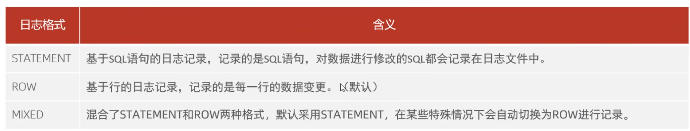
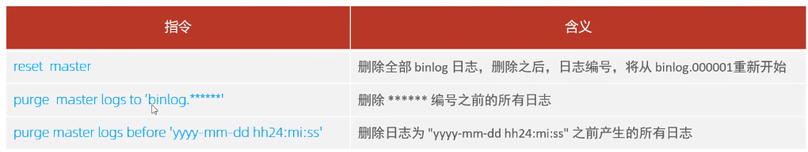
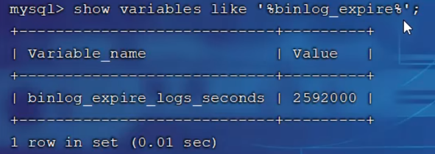

### 错误日志

错误日志是MySQL中最重要的日志之一，它记录了当mysqld启动和停止时，以及服务器在运行过程中发生任何严重错误时的相关信息。当数据库出现任何故障导致无法正常使用时，建议首先查看此日志。
该日志是默认开启的，默认存放目录/vr/log/,默认的日志文件名为mysqld.log。查看日志位置：

```shell
show variables like '%log_error%'
```

### 二进制日志

二进制日志(BINLOG)记录了所有的DDL(数据定义语言)语句和DML(数据操纵语言)语句，但不包括数据查询(SELECT、SHOW)语句。
作用：①.灾难时的数据恢复；②.MySQL的主从复制。在MySQL8版本中，默认二进制日志是开启着的，涉及到的参数如下：

```shell
show variables like '%log_bin%'
```

#### 日志格式



row格式日志：


#### 日志删除

对于比较繁忙的业务系统，每天生成的binlog数据巨大，如果长时间不清除，将会占用大量磁盘空间。可以通过以下几种方式清理日志：



也可以在MySQL的配置文件中配置二进制日志的过期时间，设置了之后，二进制日志过期会自动删除。默认存放30天。

```shell
show variables like '%binlog expires%'
```



### 查询日志

查询日志中记录了客户端的所有操作语句，而二进制日志不包含查询数据的SQL语句。默认情况下，查询日志是未开启的。如果需要开启查询日志，可以设置以下配置：

```
show variables like '%general%'
```

### 慢查询日志

慢查询日志记录了所有执行时间超过参数long_query_time设置值并且扫描记录数不小min_examined_row_imit
的所有的SQL语句的日志，默认未开启。long_query_time默认为10秒，最小为0，精度可以到微秒。

```shell
#慢查询日志
slow_query_log=1
#执行时间参数
long_query_time=2
```

默认情况下，不会记录管理语句，也不会记录不使用索引进行查找的查询。可以使用log_slow_admin_statements和更改此行为log_queries_not_using_indexes,如下所述。

```shell
#记录执行较慢的管理语句
log_slow_admin_statements =1
#记录执行较慢的未使用索引的语句
log_queries_not_using_indexes =1
```

