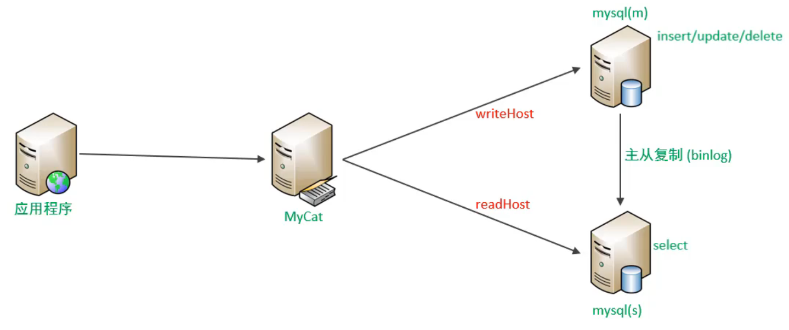
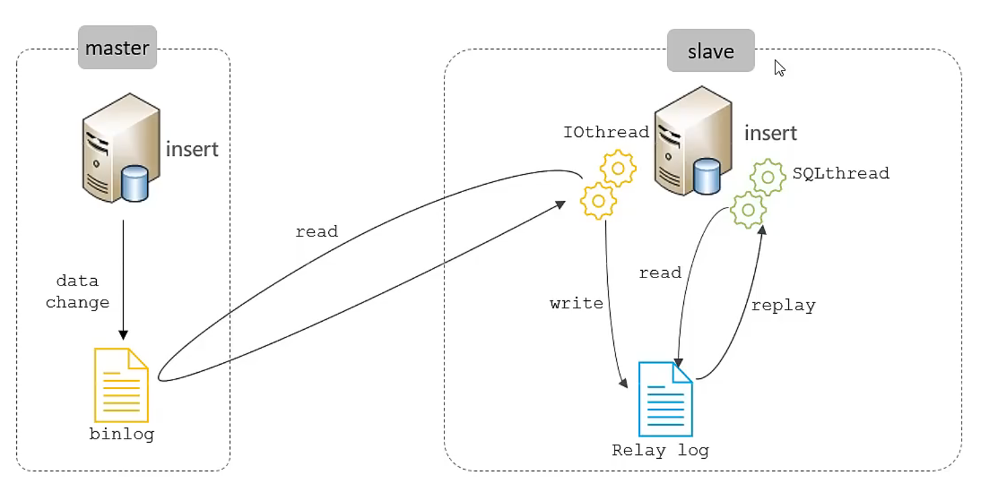
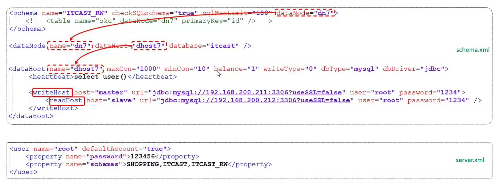
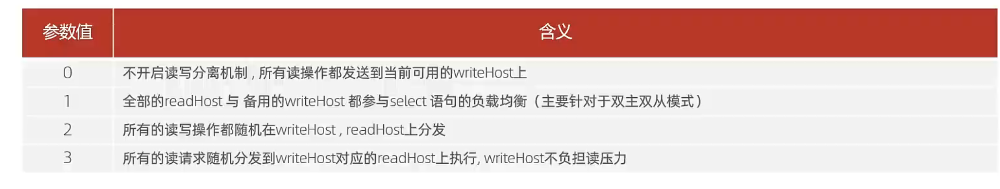
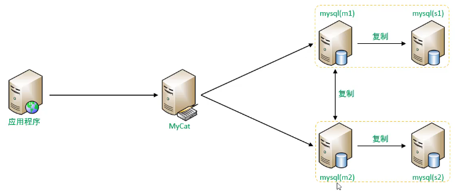
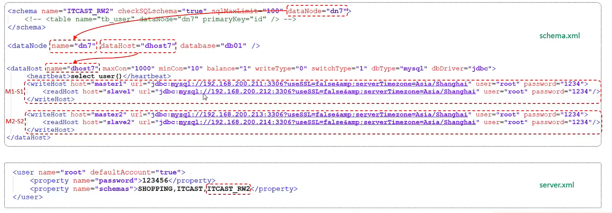

## 读写分离

### 介绍

读写分离，简单地说是把对数据库的读和写操作分开，以对应不同的数据库服务器。主数据库提供写操作，从数据库提供读操作，这样能有效地减轻单台数据库的压力。  
通过MyCat即可轻易实现上述功能，不仅可以支持MySQL,也可以支持Oracle和SQL Server。



### 一主一从

MySQL的主从复制，是基于二进制日志(binlog)实现的。



### 一主一从读写分离配置

MyCat控制后台数据库的读写分离和负载均衡由schema.xml文件datahost标签的balance属性控制。



balance负载均衡策略



问题：主库挂了之后就无法写入或者更新删除数据。

解决办法：双主双从。

### 双主双从

一个主机Master1用于处理所有写请求，它的从机Slave1和另一台主机Master2还有它的从机Slave2负责所有读请求。当Master1主机宕机后，Master2主机负责写请求，Master1、Master2互为备机。架构图如下：



### 主库配置

#### 1.修改配置文件/etc/my.cnf

```hxml
#mysql服务D,保证整个集群环境中唯一，取值范围：1-232-1，默认为1
server-id=1
#指定同步的数据库
binlog-do-db=dbC
binlog-do-db=db02
binlog-do-db=db03
#在作为从数据库的时候，有写入操作也要更新二进制日志文件
log-slave-updates
```

#### 2.重启MySQL服务器

```
systemctl restart mysqld
```

##### 两台主库创建账户并授权

```hxml
#创建tcSt用户，并设置密码，该用户可在任意主机连接该MySQL服务
CREATE USER 'itcast@'%IDENTIFIED WITH mysql native password BY 'Root@123456';
#为'itcast'@'%用户分配主从复制权限
GRANT REPLICATION SLAVE ON *.*TO 'itcast'@'%';
```

通过指令，查看两台主库的二进制日志坐标

```
show master status
```

### 从库配置

1.修改配置文件/etc/my.cnf

```hxml
#mysql服务ID,保证整个集群环境中唯一，取值范围：1-232-1，默认为1
server-id=2
```

2.重启MySQL服务器

```
systemctl restart mysqld
```

从库设置主库配置

```
CHANGE MASTER TO MASTER_HOST='192.168.200.213',MASTER_USER='itcast',MASTER_PASSWORD='Root @123456',MASTER_LOG_FILE='binlog.000002',MASTER_LOG_POS=663;
```

启动两台从库主从复制，查看从库状态.

```
start slave;
show slave status \G;
```

### 两个主库之间 主从配置

211配置213为自己的主库

```hxml
CHANGE MASTER TO MASTER_HOST='192.168.200.213',MASTER_USER='itcast',MASTER_PASSWORD='Root @123456',MASTER_LOG_FILE='binlog.000002',MASTER_LOG_POS=663;

start slave;
show slave status \G;
```

213配置211为自己的主库

```hxml
CHANGE MASTER TO MASTER_HOST='192.168.200.211',MASTER_USER='itcast',MASTER_PASSWORD='Root @123456',MASTER_LOG_FILE='binlog.000002',MASTER_LOG_POS=663;

start slave;
show slave status \G;
```

### 双主双从读写分离

配置
MyCat控制后台数据库的读写分离和负载均衡由schema.xml文件datahost标签的balance属性控制，通过writeType及switchType来完成失败自动切换的。



**balance="1"**
代表全部的readHost与stand by writeHost参与select语句的负载均衡，简单的说，当双主双从模式(M1->S1,M2->S2,并且M1与M2互为主备)，正常情况下，M2,S1,S2都参与select语句的负载均衡
**writeType**
0:写操作都转发到第1台writeHost,writeHost1挂了，会切换到writeHost2上；
1:所有的写操作都随机地发送到配置的writeHost上；
**switchType**
-1:不自动切换
1:自动切换

### 总结

1.介绍  
读写分离是为了降低单台服务器的访问压力，写走主库，读走从库。  
2.一主一从  
MySQL主从复制是基于二进制日志binlog实现的。master、slave  
3.一主一从读写分离  

```
writeHost><readHost/><writeHost、balance属性  
```

4.双主双从  
两台主库，相互复制，互为主备，增强MySQL的可用性。  
5.双主双从读写分离  

```
writeHost<readHost/>writeHost、balance、writeType、switchType
```


